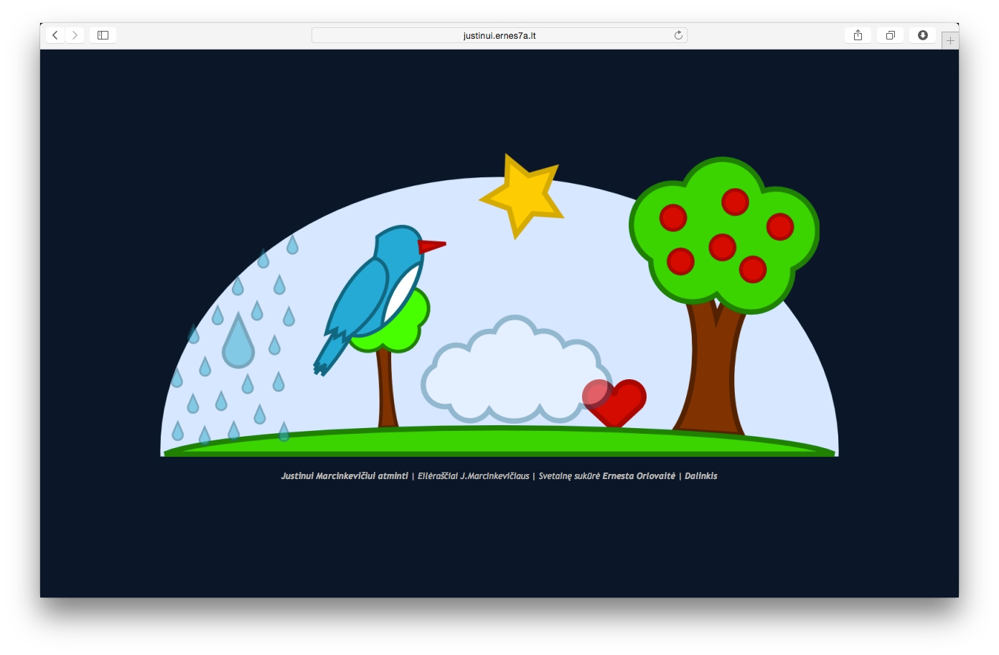

# [Justinui](http://justinui.ernes7a.lt)

>Šią naktį sapnavau, jog tu mirei:

>Kažkur toli, atrodo, varpas gaudė,

>Visam name užgeso žiburiai,

>Ir širdį juodas nerimas suspaudė,

>Ir visas aš raudojimu virtau,

>Ir meilės žodžiai daužėsi krūtinėj -

>Lig šiol, deja, nepasakyti tau,

>Dabar jie buvo žodžiai paskutiniai.

>Aš parklupau po didele našta:

>Tai mano meilė, - tavo balsas tarė.

>Ir pajutau, kad meilė - net ir ta -

>Man dvigubai sunkesnė pasidarė.

*Justinas Marcinkevičius*

## Naudoja
[jQuery](http://jquery.com/), [jQuery fancybox](http://fancybox.net/) ir truputį [AddThis](http://www.addthis.com/).

## Pagamino
**Ernesta Orlovaitė**

+ [ernes7a.lt](http://ernes7a.lt)
+ [@ernes7a](http://twitter.com/ernes7a)

## Atrodo
 
